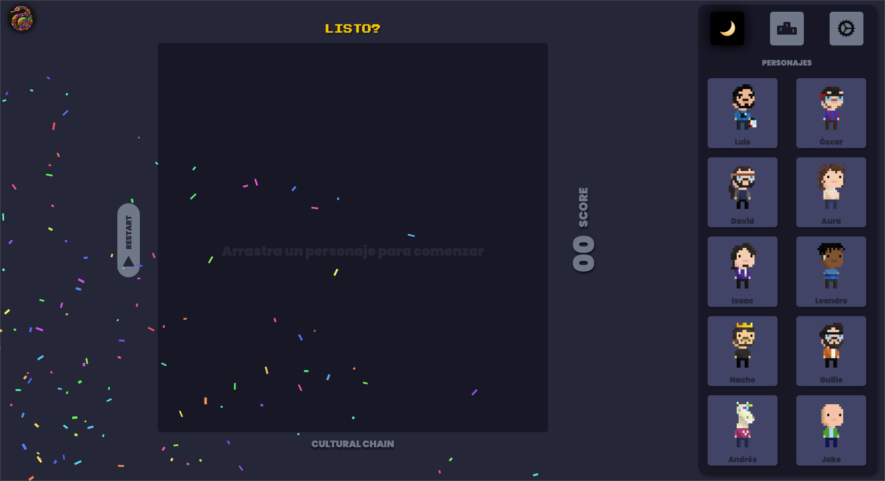

  

# Cultural Chain

Cultural Chain es un juego diseñado para transmitir conceptos fundamentales de la ciudadanía global, como la interculturalidad e inclusión. Utiliza tecnologías web como JavaScript, PHP, HTML y CSS, implementando el patrón de diseño Modelo Vista Controlador (MVC).

## Características Principales

- **Enfoque Educativo:** El juego está orientado a transmitir valores de interculturalidad e inclusión a través de actividades interactivas y desafiantes.
- **Tecnologías Utilizadas:** Desarrollado con JavaScript para la lógica del juego, PHP para la gestión de datos, y HTML/CSS para la estructura y diseño.
- **Modelo Vista Controlador (MVC):** La arquitectura MVC se ha empleado para mantener un código organizado y modular, facilitando la escalabilidad y mantenimiento.

